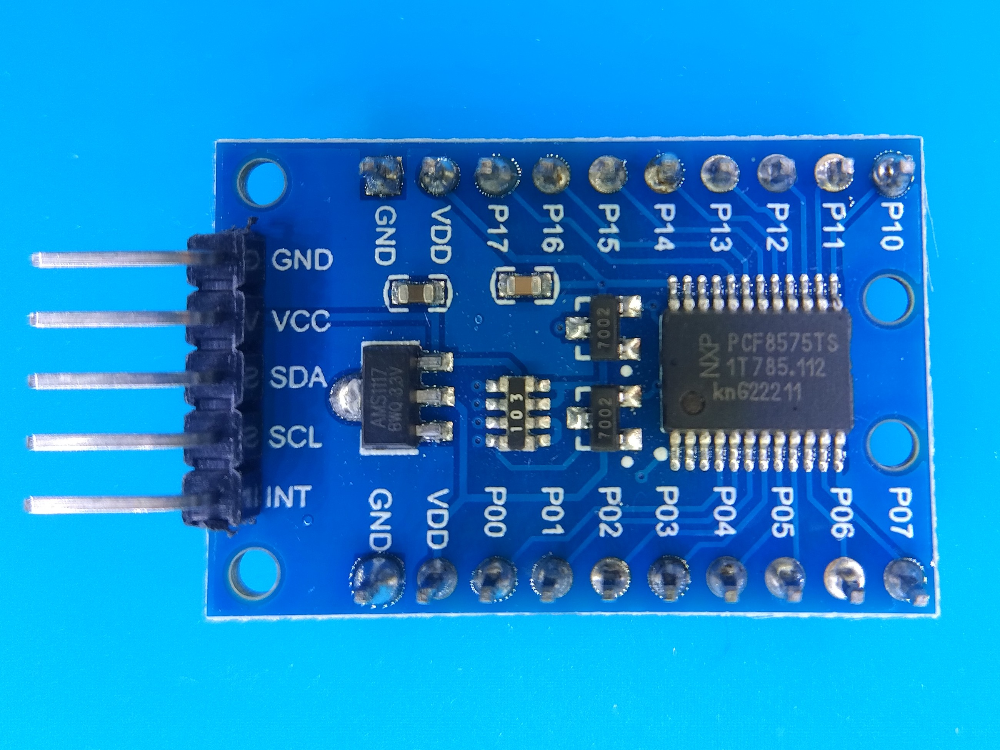
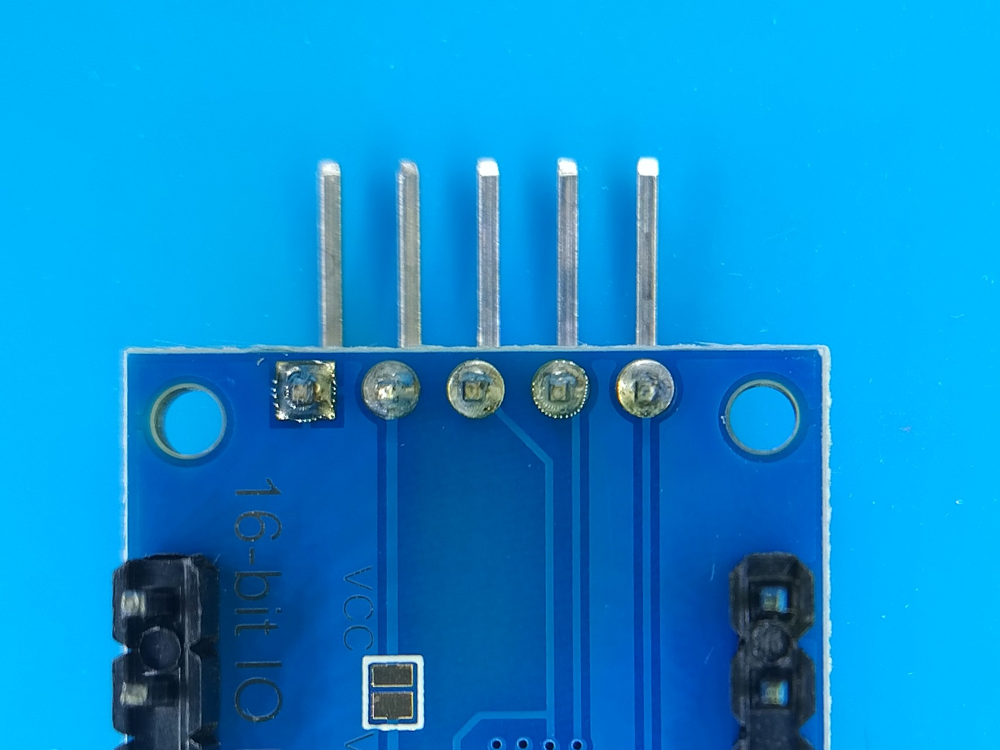
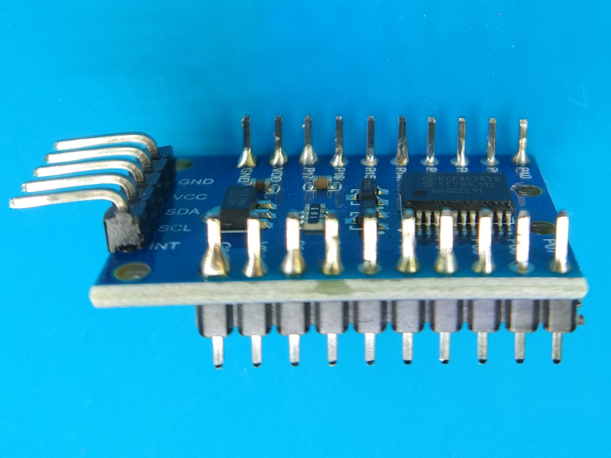

# Lebenszeitablauf

## Ziel

Gewünscht ist ein Sekundenzähler, der allerdings ab einer vorgegebenen Zahl
(z.B. 30 Jahre) abwärts zählt.

Angezeigt werden sollen die verbleibenden Sekunden mittels LED-Ziffern
(7-Segment-Anzeige).

--------------------------------------------------------------------------------

# Entwicklungstagebuch

## 7-Segment-Anzeige

Für 30 Jahre werden bereits neun Ziffern benötigt;
die gängigen fertigen Lösungen bieten höchstens acht
(die dann allerdings bereits mit einem eigenen Controller einfach angesteuert werden können).

Gefunden habe ich letztlich eine Lösung mit fünf Ziffern,
sodass zwei davon für die geforderte Aufgabe ausreichen sollten.

### Ansteuerung eines 5-Ziffern-Bauteils

Jeder dieser 5-Ziffern-Bausteine hat allerdings bereits 13 Verbindungspunkte,
die alle benötigt werden;
somit ergeben sich bei zwei dieser Bausteine 26 benötigte Pins.
(Ein üblicher ESP32 hat 25 GPIO-Pins, also genau einen zu wenig.)

Lösungsmöglichkeiten:
- Pins sparen: Da die Punkte der 7-Segment-Anzeige (also das jeweils achte Segment)
  nicht benötigt werden, genügen pro Baustein 12 Verbindungen.
  Da die Aufgabe mit einem Arduino Nano mit 20 GPIO-Pins gelöst werden soll, sind dies allerdings immer noch zu viele.
  (Es wäre aber ein interessanter Zwischenschritt auf dem Weg zur endgültigen Lösung.)
- IO-Expander: Die Anzahl der nutzbaren Pins kann via Baustein erhöht werden.
- Eigenen Mikrocontroller pro 5-Ziffern-Anzeige programmieren und die beiden dann ansteuern.
  (Dies könnte die interessanteste Vorgehensweise sein - allerdings auch die hardware-aufwendigste.)

### Anzeigen fünf verschiedener Ziffern pro Bauteil

Die vorgegebene Verdrahtung lässt bei konstantem Strom auf allen fünf Ziffern
nur die gleiche Anzeige erscheinen
(oder gar keine, wenn der Ausgang der Ziffer nicht geschaltet ist).

Die Ansteuerung muss also im millisekunden-gesteuerten Wechsel erfolgen.

Auch abhängig von der gewählten Lösung des Anschlusses der beiden Bausteine ist
die Taktung des Wechsels zwischen den Ziffern:
Kann jede Ziffer bei einem Fünftel oder einem Zehntel der Zeit angesteuert werden?

## Test 1: Fünfstellige Zahlen anzeigen

Ein erstes kleines Testprogramm soll die Darstellung
beliebiger fünfstelliger Zahlen in einem Anzeigebauteil ermöglichen.

### Probleme

Im ersten Versuch will die Arduino IDE mich weder Funktionen mit std::bitset als Parameter
definieren lassen noch mir einen vernünftigen seriellen Output anzeigen.
Zudem wird die fünfte Ziffer nicht mit angezeigt.

Zum zweiten Punkt habe ich den Verdacht, dass eventuell einer der benutzten Pins
mit zum Serial gehört;
zum dritten, dass eventuell eine Verkabelung nicht stimmt.

Für einen Abend war das aber erst einmal genug angesammelter Frust
und es geht wann anders weiter.

### Lösungen

Die Lösung für das fehlgeschlagene include ist, die Präcompiler-Anweisung direkt
in die erste Datei einzufügen.
Beim Zusammenkopieren der Sketches mit Vorwegnahme der Funktionsdeklarationen
kommt es ansonsten zu diesen Fehlern.

Die beiden anderen Punkte lagen tatsächlich an der Verkabelung:
Einerseits hatte ich RX0 und TX0 als Funktions-Pins verwendet
und mir damit selbst den seriellen Monitor verbaut,
andererseits hatte ich nicht berücksichtigt, dass einige GPIO-Pins
nur für den INPUT verwendet werden können.

### Erfreuliches

Das Anzeigen fünf verschiedener Ziffern gleichzeitig hat dafür direkt im
ersten Versuch funktioniert - ein freudiger Hoffnungsschimmer.

## Lötungen

FÜr den nächsten Test benötige ich einen IO-Expander,
in diesem Fall will ich es mit einem PCF8575 versuchen.
Diesen muss ich aber erst einmal mit seinen Steckleisten verlöten,
um ihn ordentlich testen zu können.
Es folgen die Bilder meiner ersten ganz eigenen Lötung.

Wenn das jetzt auch noch funktioniert damit, bin ich doch ganz zufrieden -
obgleich der alte Lötkolben (oder das Lötzinn) sich doch etwas gewöhnungsbedürftig verhalten hat.

## Test 2: Der IO-Expander

Beim Verkabeln des IO-Expanders mit einer fünfstelligen 7-Segment-Anzeige
kommt mir ein mögliches Problem in den Kopf:
Kann der Expander auch OUTPUT-Pins schalten?

Dies wäre wichtig, um die fünf Ausgänge der Anzeige durchschalten zu können.
Andernfalls müssten die Ausgänge doch direkt an den Mikrocontroller geführt werden.
Immerhin könnte man jeweils zwei Ausgänge (jeweils eine der beiden fünfstellen Anzeigen) gleichzeitig ansteuern,
sofern man dann auch ihre Anzeige-Daten entsprechend synchronisiert.

Das werden die Tests dann als nächstes zeigen.

